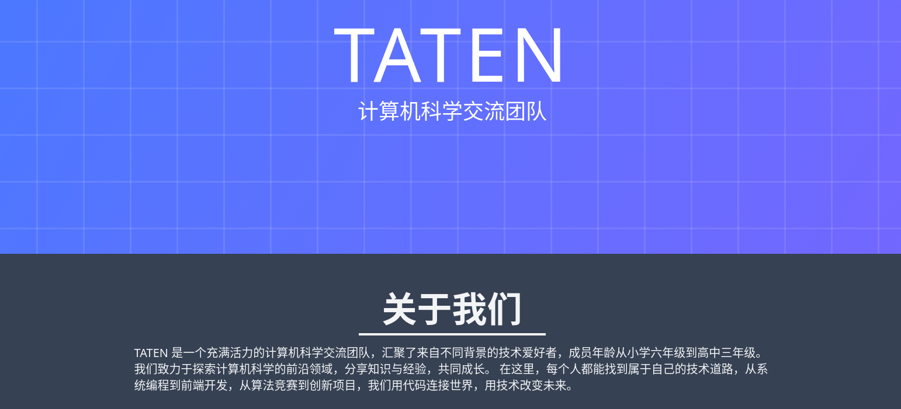

# TATEN

一群热爱编程的学生，致力于探索技术的无限可能。

[TATEN 官网](https://taten.xyz) | [GitHub 主页](https://github.com/tatencn)

---
## 关于我们

TATEN 是一个由各地的初中生与高中生自发组织的技术交流团队。专注于计算机、开源项目与工程实践。无论是算法、前后端开发、App、游戏制作，还是服务器运维，我们都勇于尝试、持续学习。

我们相信：**年龄不是限制，兴趣和实践才是最好的老师。**
---

## 我们的网站

访问我们的主页：[taten.xyz](https://taten.xyz)

网站内容包括：

- 成员介绍
- 项目展示
- 技术分享与博客
- 最新动态

---

## 我们在做什么？

- 开源项目开发
- 编程学习与分享
- 技术文章撰写
- 线上技术交流

## 项目展示（持续更新ing）

| 项目名称                                                    | 简介                                       | 参与者                                           | 状态   |
| ----------------------------------------------------------- | ------------------------------------------ | ------------------------------------------------ | ------ |
| [团队主页](taten.xyz)                                       | 展示团队信息、项目入口与联系方式的静态网站 | All Members                                      | 已完成 |
| [猜歌游戏](https://github.com/hungryhenry101/Rhythm-Riddle) | 使用 Flutter 开发的猜歌游戏，多平台支持    | [HungryHenry](https://github.com/hungryhenry101) | 已完成 |
| [LINMOH の 书库](https://book.linmohan.fun/)                | 精选优质电子书资源，助力学习成长           | [LINMOH](https://github.com/LINMOH)              | 已完成 |

---

## 我们拥有的技术栈

- 前端开发：HTML / CSS / JavaScript
- 后端开发：PHP / MySQL / Node.js / PostgreSQL
- 博客平台：Hexo / Typecho / Hugo / Halo
- 编程语言：Python / C++ / Java
- 操作系统：Windows / Linux / Mac OS
- 团队协作：Git / GitHub / GitLab / SVN
- 其他技术：树莓派 / Flutter / QT

## Join us!

如果你是热爱技术的中小学生，欢迎加入 TATEN！

- 联系方式见官网
- 无需高深背景，只需对技术充满好奇

---

© TATEN – Since 2025

